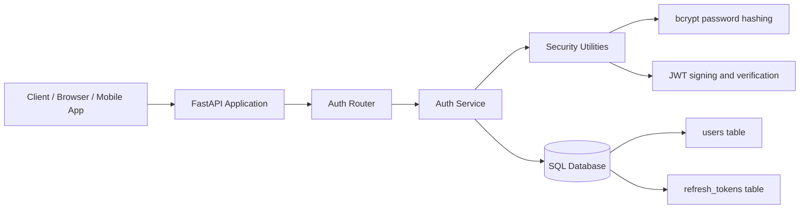
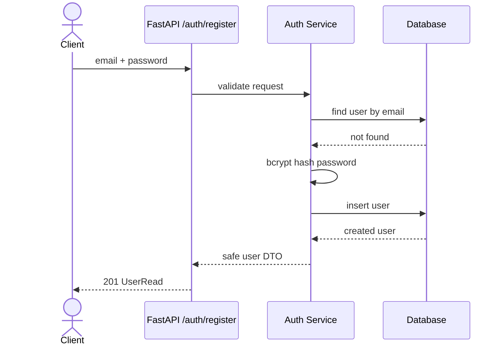
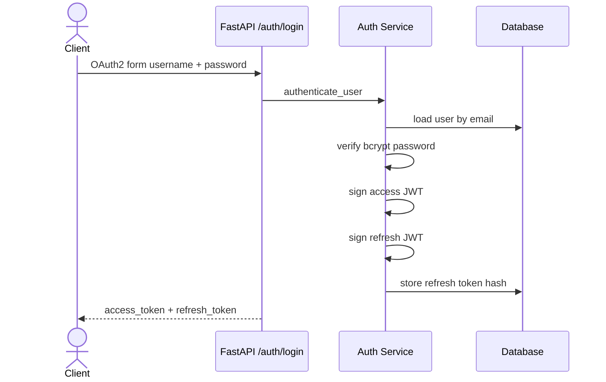
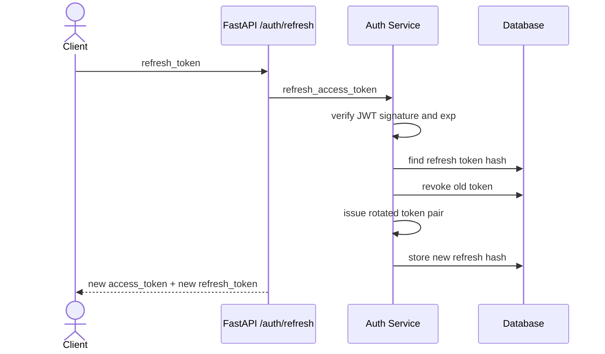
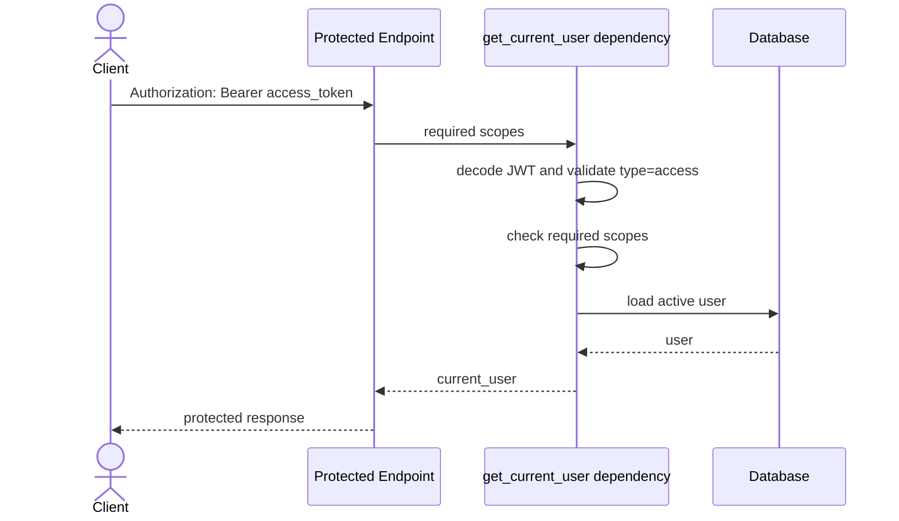

# AUTH_NOTES.md — Production-Style Authentication Service

## Architecture Diagram

## Register Sequence

## Login Sequence

## Refresh Token Sequence

## Protected Route and RBAC Sequence

## JWT

### WHY
JWTs let an API verify claims without querying a session store for every request. The server signs the token, and later validates the signature to prove the token was issued by the service and was not modified.

### WHEN
Use JWT access tokens for stateless API authorization between a trusted backend and clients. Avoid long-lived access JWTs because they are difficult to revoke immediately.

### HOW
This project creates JWTs in `app/core/security.py` with `sub`, `type`, `scopes`, `iat`, `exp`, and `jti` claims. The API decodes them before protected routes and rejects invalid, expired, or wrong-type tokens.

## Access Tokens

### WHY
Access tokens prove that the caller is authenticated and authorized for a short period.

### WHEN
Send an access token on every protected API request in the `Authorization: Bearer <token>` header.

### HOW
Access tokens are short-lived JWTs with `type=access` and scopes derived from the user's role.

## Refresh Tokens

### WHY
Refresh tokens let users stay signed in without making access tokens dangerously long-lived.

### WHEN
Use refresh tokens only with the token refresh endpoint. Store them more carefully than access tokens.

### HOW
This project stores only a SHA-256 digest of each refresh token, revokes the old token during refresh, and issues a rotated pair.

## OAuth2

### WHY
OAuth2 standardizes how clients obtain and present tokens.

### WHEN
Use OAuth2 patterns when building APIs consumed by web apps, mobile apps, CLI tools, or third-party clients.

### HOW
FastAPI's `OAuth2PasswordBearer` documents the bearer-token security scheme, while `/auth/login` accepts `OAuth2PasswordRequestForm`.

## Scopes

### WHY
Scopes express permissions in a compact, token-friendly format.

### WHEN
Use scopes when endpoints need permission checks more granular than simply "logged in".

### HOW
The dependency checks that required endpoint scopes are present in the access token's `scopes` claim.

## Password Hashing and bcrypt

### WHY
Passwords must never be stored directly. If a database leaks, plain-text passwords immediately compromise users across many services.

### WHEN
Hash every password before storage and verify login attempts against the hash.

### HOW
bcrypt is intentionally slow and salted. This makes offline guessing expensive even if an attacker steals password hashes.

## Why Not Store Passwords Directly?

Plain passwords create catastrophic blast radius: database admins can read them, logs/backups can leak them, attackers can reuse them elsewhere, and the company cannot safely prove user secrets were protected. Store password hashes only.
